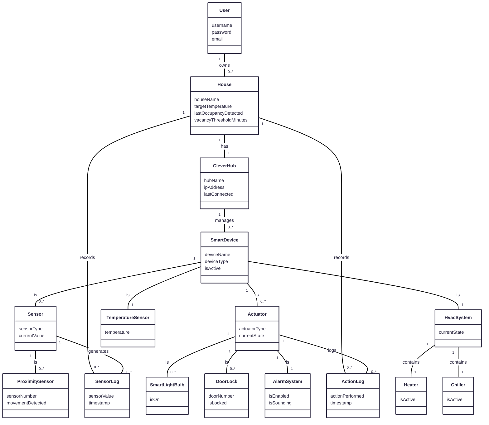

```mermaid
---
config:
  theme: redux
---
classDiagram
    class User {
        username
        password
        email
    }

    class House {
        houseName
        targetTemperature
        lastOccupancyDetected
        vacancyThresholdMinutes
    }

    class CleverHub {
        hubName
        ipAddress
        lastConnected
    }

    class SmartDevice {
        deviceName
        deviceType
        isActive
    }

    class Sensor {
        sensorType
        currentValue
    }

    class Actuator {
        actuatorType
        currentState
    }

    class SmartLightBulb {
        isOn
    }

    class TemperatureSensor {
        temperature
    }

    class DoorLock {
        doorNumber
        isLocked
    }

    class ProximitySensor {
        sensorNumber
        movementDetected
    }

    class AlarmSystem {
        isEnabled
        isSounding
    }

    class HvacSystem {
    currentState
    }
    class Heater {
        isActive
    }

    class Chiller {
        isActive
    }

    class SensorLog {
        sensorValue
        timestamp
    }

    class ActionLog {
        actionPerformed
        timestamp
    }

    User "1" -- "0..*" House : owns
    House "1" -- "1" CleverHub : has
    CleverHub "1" -- "0..*" SmartDevice : manages
    SmartDevice "1" -- "0..*" Sensor : is
    SmartDevice "1" -- "0..*" Actuator : is
    SmartDevice "1" -- "1" TemperatureSensor : is
    SmartDevice "1" -- "1" HvacSystem : is
    Sensor "1" -- "0..*" ProximitySensor : is
    Actuator "1" -- "0..*" SmartLightBulb : is
    Actuator "1" -- "0..*" DoorLock : is
    Actuator "1" -- "1" AlarmSystem : is
    HvacSystem "1" -- "1" Heater : contains
    HvacSystem "1" -- "1" Chiller : contains
    House "1" -- "0..*" SensorLog : records
    House "1" -- "0..*" ActionLog : records
    Sensor "1" -- "0..*" SensorLog : generates
    Actuator "1" -- "0..*" ActionLog : logs
```
