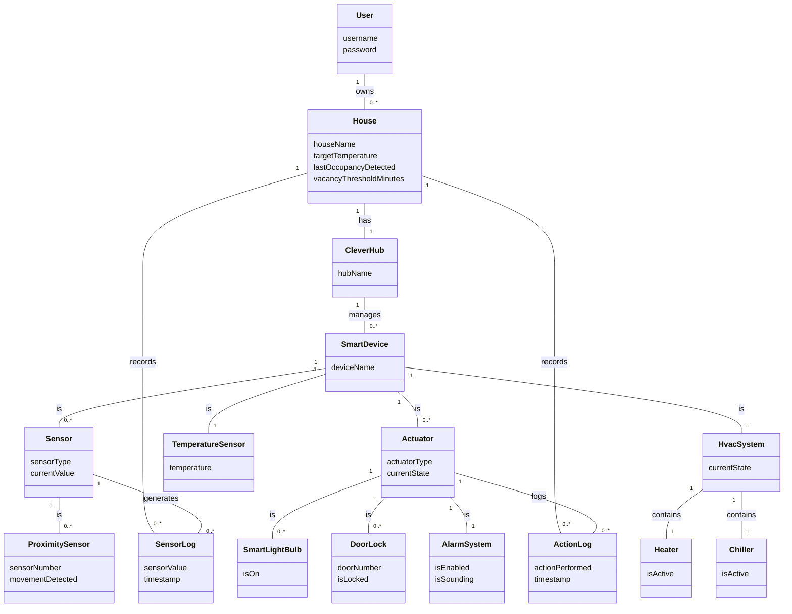

# Group-11-Eleven-Group
Software Design Repository — Group 11

**Team name:** Eleven-Group

**Members:** Martin Contreras · Matias de la Sota · Benjamin Duran

## Main Functionalities Included in This Submission

1. **CleverHub protocol handling** — Parse and serialize all protocol message types: `HL`, `GS`, `SS`, `ACC`, `REF`, `SU`, `OK`, `ERR`.
2. **CleverHub authentication** — In-memory credential store; accept valid hubs with `ACC`, reject invalid ones with `REF`.
3. **TCP CleverHub server** — Listen for connections, handle each hub in its own thread, store connected homes, support `GS` and `SS` commands.
4. **Console-based UI** — List homes, request status, set device state, list credentials, exit safely.
5. **Static type checking** — Full Python type hints; mypy configured with `strict = true`.

---

## Quality Attribute Scenarios

### Scenario 1 — Security

**Justification:** The platform allows users to remotely control their homes over the Internet. A security breach could let unauthorized actors unlock doors or disable alarms. Every connection attempt must be validated before any house data is exposed.

| | |
|---|---|
| **Category / Quality Attribute** | Security |
| **Description** | An unauthorized actor attempts to connect using invalid credentials |
| **Stimulus Source** | Unauthorized external actor |
| **Stimulus** | Connection attempt with invalid or stolen CleverHub credentials |
| **Environment** | Platform running normally, accepting incoming connections |
| **Artifact** | CleverHub connection handler and credential store |
| **Response** | The platform rejects the connection and sends `REF.` — no house data is exposed |
| **Response Measure** | 100 % of invalid-credential attempts are rejected within 500 ms |
| **Priority** | High |
| **Difficulty** | Medium |

---

### Scenario 2 — Scalability

**Justification:** The platform is expected to serve millions of customers and hundreds of CleverHubs simultaneously. Each hub connection is handled in its own thread so the server can process requests concurrently.

| | |
|---|---|
| **Category / Quality Attribute** | Scalability |
| **Description** | Multiple CleverHubs send requests simultaneously without performance degradation |
| **Stimulus Source** | Multiple CleverHubs connecting simultaneously |
| **Stimulus** | 100 CleverHubs send a `GS` request at the same time |
| **Environment** | Platform running under normal operating conditions |
| **Artifact** | CleverHub connection handler (`HubServer`) |
| **Response** | All requests are handled concurrently without dropping connections |
| **Response Measure** | All 100 requests are processed and responded to within 2 seconds |
| **Priority** | High |
| **Difficulty** | High |

---

## Technical Constraints

1. **CleverHub Communication Protocol** — The platform must implement the exact text-based TCP/IP protocol defined by the CleverHub team (`HL`, `GS`, `SS`, `ACC`, `REF`, `SU`, `OK`, `ERR`). This protocol is externally defined and cannot be modified; any deviation makes the platform incompatible with real CleverHubs.

2. **Python** — The team agreed to use Python as the main language. All implementation, tooling (mypy, pytest), and Docker configuration must be compatible with Python, limiting the available framework choices.

---

## Domain Model



### Relationships

- **User owns House** — A user can own zero or more houses registered on the platform.
- **House has CleverHub** — Each house has exactly one CleverHub acting as the gateway to its devices.
- **CleverHub manages SmartDevice** — The platform never communicates directly with individual smart devices; all communication goes through the CleverHub.
- **House records SensorLog / ActionLog** — The platform keeps a history of sensor readings and actions performed per house (planned for a future iteration).

### Domain Rules

1. If a door is manually unlocked while the alarm is enabled, or movement is detected while the alarm is enabled → the alarm starts sounding.
2. If a house has been vacant for more than `vacancyThresholdMinutes` without movement → lock all doors, turn off all lights, enable alarm.
3. If enough movement is detected → turn on lights automatically.
4. The HVAC automatically sets `currentState` to HEATING or COOLING based on `targetTemperature` vs. the current temperature reading. HEATING and COOLING are mutually exclusive.

---

## C4 System Context Diagram

The system context diagram defines the CleverHome Platform as the central software system, surrounded by the two external actors that interact with it.

**CleverHome Platform** is the software system being built. It is responsible for connecting users to their smart homes by communicating with CleverHubs installed in each house.

**User** is a person who interacts with the platform through a console interface. They send requests to monitor sensor data and control smart devices, and receive information about the current state of their home in return.

**CleverHub** is an external software system — a hardware device installed in each home that acts as an intermediary between the platform and the smart devices inside the house. Communication is explicitly directional: the CleverHub initiates the connection by sending `HL`, and also sends state updates and responses (`SU`, `OK`, `ERR`). The platform sends commands to request or modify state (`GS`, `SS`).

The context diagram deliberately excludes internal architecture and technology details, focusing only on who uses the system and what external systems it depends on.

*(See `Software Design Project Diagram (1).pdf` for the diagram image.)*

---

## C4 Containers Diagram

The containers diagram shows the internal logical structure of the CleverHome Platform for this first iteration. Only containers actually implemented in this submission are included. Docker is not shown here because it is a deployment concern, not a logical architectural one.

**Console Application** — Python CLI. Handles all user interaction: listing homes, viewing sensor states, sending device commands, and listing stored credentials. Communicates with the Backend Application via direct function calls.

**Backend Application** — Python server application. Centralises all business logic:
- Accepts and manages TCP connections from CleverHubs
- Implements the CleverHub communication protocol (`HL`, `GS`, `SS`)
- Validates hub credentials using an in-memory credential store
- Maintains the current state of each connected home in memory

The separation between Console and Backend follows the **Separation of Concerns** principle: user interaction is isolated from protocol handling and business logic. This makes it straightforward to replace the console with a web UI in a future iteration without touching the backend.

*(See `Software Design Project Diagram (1).pdf` for the diagram image.)*

---

## UML Sequence Diagrams

Three sequence diagrams document the complete CleverHub communication protocol.

### Diagram 1 — Hub Connection (HL)

The CleverHub initiates all connections by sending an `HL` message containing credentials (`USR`, `PWD`), the home identifier (`HOM`), and the target temperature (`TT`). The Backend validates credentials against the Credential Store and checks for duplicate home names. If valid, it responds with `ACC`; otherwise `REF`. This is the only message type initiated by the CleverHub.

### Diagram 2 — Get State (GS / SU)

Triggered by the user via the Console Application, the platform sends a `GS` message (no parameters) to the relevant CleverHub. The hub responds with an `SU` message containing all current state parameters: temperature reading (`TR`), door states (`DS[N]`), light states (`LS[N]`), proximity sensors (`PS[N]`), alarm state (`AS`), alarm sounding (`AO`), heater (`HS`), and chiller (`CS`). The backend parses and stores this state, then returns it to the console for display.

### Diagram 3 — Set State (SS / OK / ERR)

The user issues a device command through the console. The backend constructs and sends an `SS` message with the parameters to modify (e.g., `SS:DS1=1;LS1=0;LS2=0.`). The CleverHub responds with `OK` if the state was successfully applied, or `ERR` if it failed. The outcome is displayed to the user. Note that read-only parameters (`TR`, `PS[N]`) cannot be set via `SS`.

*(See `Software Design Project Diagram (1).pdf` for the diagram images.)*

---

## Code Structure

```
.github/
  workflows/
    ci.yml

backend/
  app/
    cleverhome/
      __init__.py
      credential_store.py   # AbstractCredentialStore interface + InMemoryCredentialStore
      protocol.py           # Parser, serializer, and message builders
      hub_server.py         # AbstractHubServer interface + HubServer (TCP)
      console_ui.py         # Console menu and user interaction
    tests/
      __init__.py
      test_cleverhome.py    # 30+ unit tests
  Dockerfile
  requirements.txt
  mypy.ini
  pytest.ini
  
docker-compose.yml
AI.md
README.md
Software Design Project Diagram (1).pdf
.gitignore
```

### Design decisions

**Abstract interfaces (Dependency Inversion)** — `HubServer` receives an `AbstractCredentialStore`, and the Console receives an `AbstractHubServer`. This means neither depends on a concrete class, making it trivial to swap the in-memory store for a database-backed one in the next iteration, or to inject a fake server in tests.

**Protocol module isolated (Single Responsibility)** — `protocol.py` only knows how to parse and serialize messages. It has no knowledge of sockets, threading, or UI concerns.

**One thread per hub (Scalability)** — Each accepted CleverHub connection runs in its own daemon thread, allowing the server to handle hundreds of concurrent hubs.

---

## Dockerized Structure

The `docker-compose.yml` starts the Backend Application (which also hosts the Console UI):

```
docker-compose.yml
  └── backend   (Python 3.12-slim, port 5000, stdin/tty open for console interaction)
```

The CleverHub simulator is **not included** in the compose file, as required. It must be run separately so it can connect to the platform over the network.

---

## How to Run

### 1. Start the platform console

```bash
docker-compose run --rm --service-ports backend
```

This starts the console menu on your terminal and publishes port `5000`.
If the image has not been built yet, run `docker-compose build backend` first.

### 2. Connect the CleverHub simulator (separate terminal)

```bash
docker run -it --network host secheverriag/cleverhub-sim:p1a localhost 5000 hub_user_1 Password123! casa1
```

> If the simulator uses different flags, check its own README — the hub will send `HL:USR=hub_user_1;PWD=Password123!;HOM=casa1;TT=20.` on connect.

The simulator prompt is only for changing simulated devices:

```
Enter a command: d=[toggle door], l=[toggle light], p=[toggle proximity], RET=[show current status]:
```

Do not type the platform menu options (`1`, `2`, `3`, `4`, `5`) in the simulator terminal. Type those options in the platform console terminal from step 1.

### 3. Use the console menu

```
====== CleverHome Platform Console ======
1. List connected homes
2. Request house status
3. Set device state
4. List stored credentials
5. Exit
=========================================
```

- **Option 1** — shows all currently connected home names.
- **Option 2** — prompts for a home name, sends `GS.`, and displays the full state.
- **Option 3** — prompts for a home name and parameters (e.g., `DS1=1;LS1=0`), sends `SS:...`, and shows the result.
- **Option 4** — lists the usernames in the credential store (passwords hidden).
- **Option 5** — stops the server and exits.

### 4. Run without Docker (local development)

```bash
cd backend
PYTHONPATH=app python -m cleverhome.console_ui
```

---

## How to Run Tests

```bash
cd backend
PYTHONPATH=app pytest --tb=short -v
```

### How to Run mypy

```bash
cd backend
mypy app/cleverhome --config-file mypy.ini
```

---

## Tests

All tests are in `backend/app/tests/test_cleverhome.py` and follow the **Arrange / Act / Assert** structure.

### Test coverage and justification

| Group | Tests | What is verified |
|---|---|---|
| `parse_message` — valid | 5 | `GS`, `ACC`, `HL` (all params), `SU` (full state), `SS` parse correctly |
| `parse_message` — invalid | 6 | Empty string, missing `.`, unknown type, colon with no params, missing `=`, empty value — all raise `ProtocolError` |
| `serialize_message` / builders | 9 | No-param serialization, params serialization, all six builder functions, full roundtrip |
| `InMemoryCredentialStore` | 8 | Valid credentials accepted, wrong password rejected, unknown user rejected, empty username/password rejected, both users valid, `list_credentials` returns all usernames, `list_credentials` returns a copy (mutation safety) |

Invalid-case tests are included specifically because the platform will be tested with malformed data by the customer.

---

## GitHub Actions (CI)

The workflow at `.github/workflows/ci.yml` runs on every push and pull request with **three independent jobs**, each capped at `timeout-minutes: 5`:

| Job | What it does |
|---|---|
| `test` | Runs `pytest` with `PYTHONPATH=app` |
| `typecheck` | Runs `mypy app/cleverhome --config-file mypy.ini` |
| `docker-build` | Builds the backend Docker image to confirm the `Dockerfile` is valid |

---

## What Was Not Completed

Nothing from the iteration scope was left incomplete. The following items are **intentionally deferred** to future iterations as stated in the requirements:

- Database-backed credential store (currently in-memory hashmap as required).
- Web-based frontend UI.
- Rule engine (alarm, vacancy, HVAC automation).
- Sensor and action logs with persistence.
- User login / registration for end-users (distinct from hub credentials).
